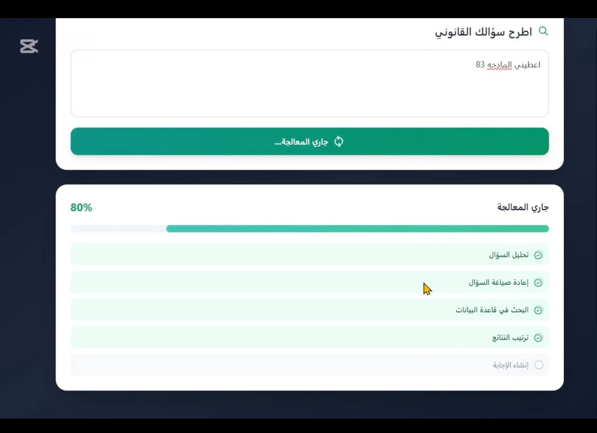
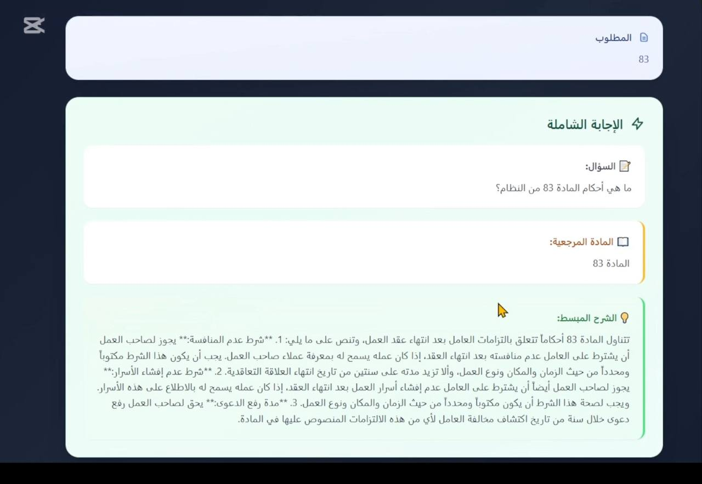
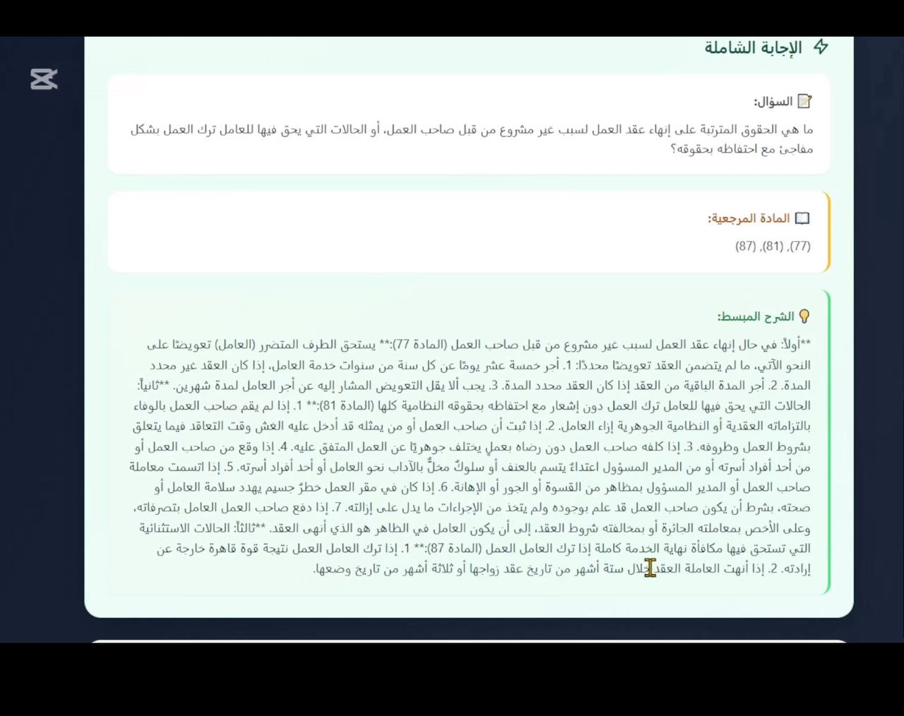
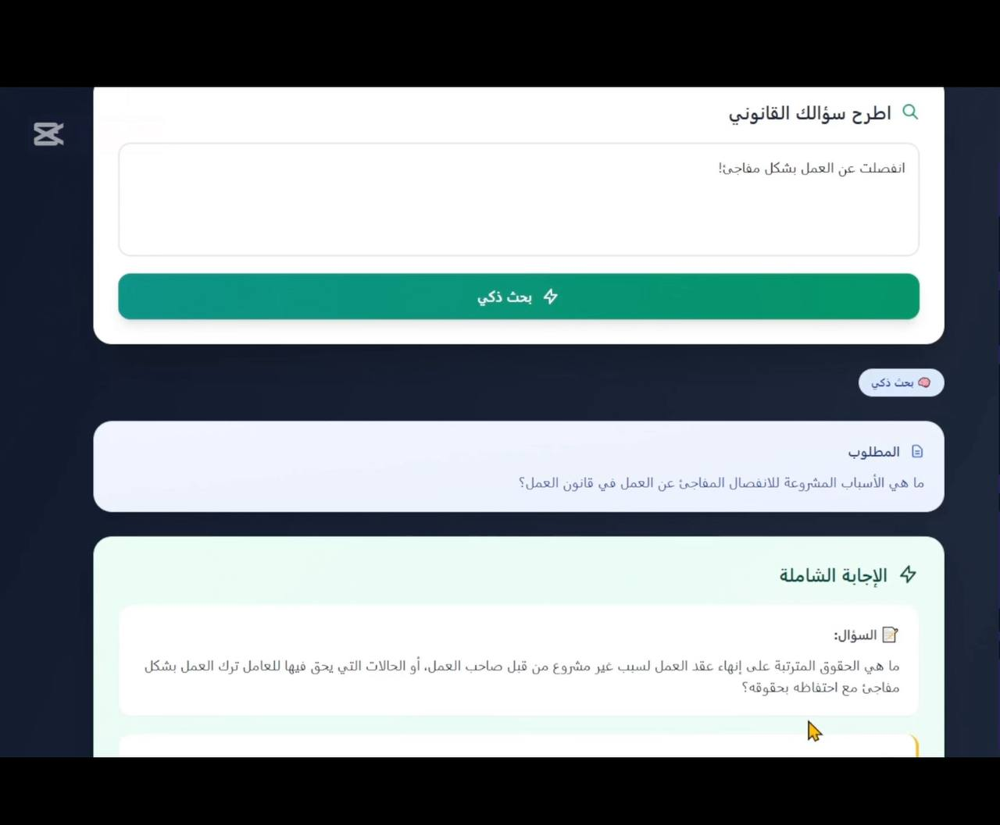

# KSA Saudi Labor Law RAG  

**An intelligent Retrieval-Augmented Generation (RAG) system for answering questions related to the Saudi Labor Law (نظام العمل السعودي).**

This project provides accurate, citation-based answers to user questions by searching, retrieving, and reasoning over official Saudi Labor Law articles.  
It supports question rewriting, hybrid search, and detailed legal references.

---

## 🚀 Features

### 🔍 1. Smart Question Rewriting  
The system rewrites user queries to clearer, law-friendly formats to improve retrieval accuracy.

### 📚 2. Hybrid Search (article + Embeddings)  
Combines:
- **Semantic search** using Jina Embeddings  
- **Keyword/article search**  
for maximum precision.

### 🧠 3. Context-Aware Answer Generation  
Uses a language model to:
- Understand the rewritten question  
- Retrieve the most relevant legal articles  
- Generate a clear, structured answer  
- Provide **full article text** for transparency

### 📑 4. ChromaDB Vector Store  
All articles are embedded and stored locally using Chroma.

---

## 📥 Data Source  
Manually structured dataset from the Saudi Labor Law including:

- Article number  
- Part  
- Chapter  
- Title  
- Article text  
- Explanation  

---

## 📘 Example Output

**Question:**  
> ما هي حقوقي عند انتهاء العقد غير محدد المدة؟

**Answer:**  
- النظام ينص على …  
- المادة المستخدمة: *المادة ٧٧*  
- يعرض النظام النص الكامل للمادة أيضًا.

---
## 📸 Application Screenshots

Below are selected screenshots showcasing the core functionalities of the **Saudi Labor Law RAG System**, including smart legal search, article retrieval, and detailed explanation generation.

---

### 1. Smart Legal Query Input
> A clean interface for entering any labor-law related question in Arabic.

---

### 2. Hybrid Search Progress & Confidence
> Shows search progress, ranking confidence, and retrieved article candidates.

---

### 3. Retrieved Article + Clear Legal Answer
> The system retrieves the correct article, rewrites the question, and provides a structured legal explanation.

---

### 4. Full Article Display With Explanation
> Displays the entire article text from the Saudi Labor Law for transparency and legal reference.

## 🎥 Demo Video  
[اضغط هنا لمشاهدة الديمو](assets/video_2025-11-18_16-21-20.mp4)

---

## 🎯 Purpose  
Built for:

- HR teams  
- Legal assistants  
- Employees & employers  
- Educational & portfolio use  

---

## 📩 Contact  
**Developer:** Osama Alghamdi

---

## ⭐ Star the Repo  
إذا أعجبك المشروع لا تنسَ تعمل Star 🌟
